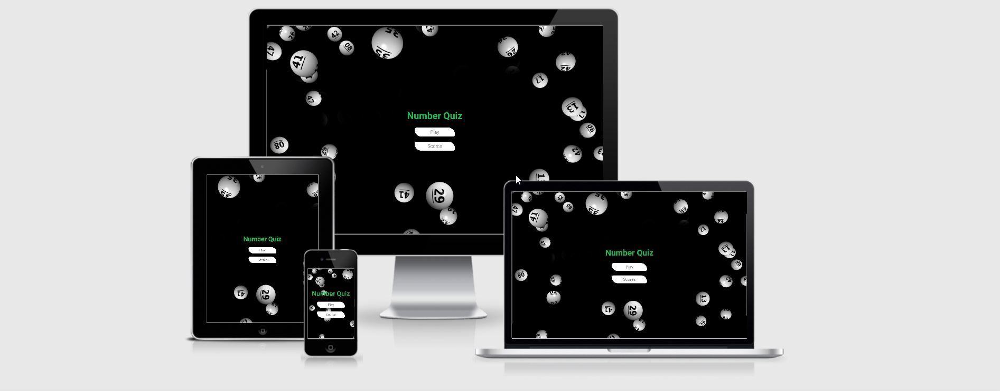
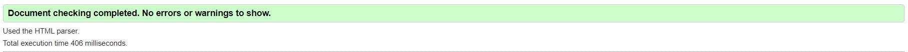
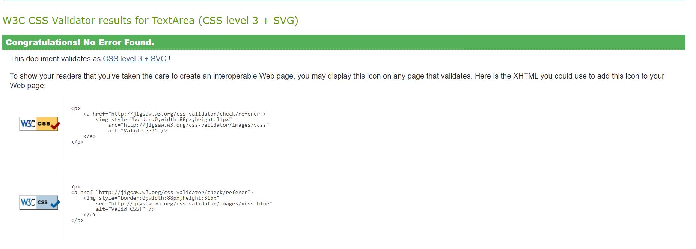
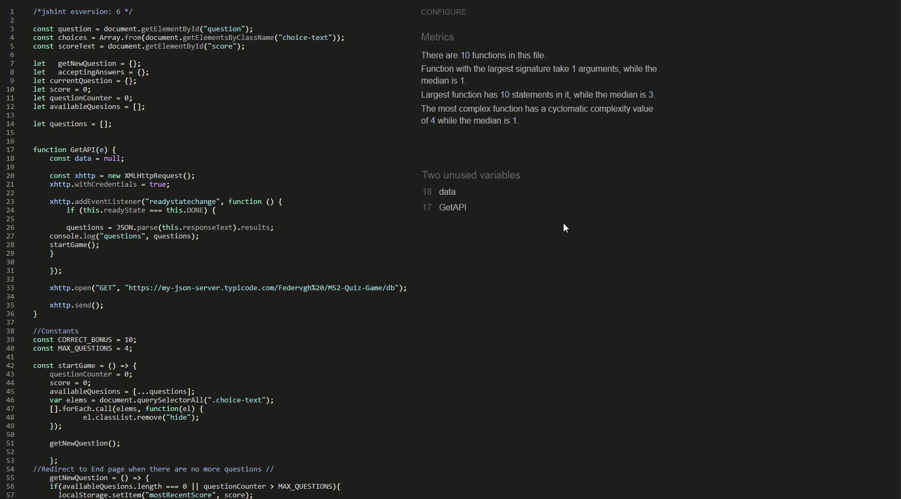
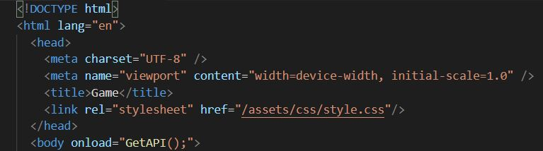

# Number Quiz

Live Demo [here](https://federvgh.github.io/MS2-Quiz-Game/).

<h2 align="center"></h2>

## Table of Contents

> - [Overview](#overview)
> - [UX](#ux)
> - [User Stories](#user-stories)
> - [Features](#features)
> - [Technologies Used](#technologies-used)
> - [Testing](#testing)
> - [Deployment](#deployment)
> - [Bugs and Solutions](#Bugs-and-Solutions)
> - [Credits](#credits)

## Overview

The idea of this project was to create a fun a quiz, easy to use, with a smooth design. There are a lot of quizes on the web
and i wanted to do something a bit different, a music quiz was one of my first ideas but after doing some research i realize 
i did not have the skills to do it the way i wanted so i decided to go for something simpler but fun as well. I have always liked 
numbers and thought of combining that with trivia might work and thats how this project came to be. 

## UX

- ## Owner Stories

    1. As the Owner, I want the game to be entertaining and give the user the feeling to keep playing.
    2. As the Owner, I want the game to give some useful trivia about numbers. 
    3. As the owner, I want the user to get courious about the "why" of the answers.  
    4. As the Owner, I want this game to show my new skills with javascript.

- ### User stories

  - #### First Time and Returning Visitor

    1. As a user, I want to be able to see my score.
    2. As a user, I want the game to be intuitive and easy to play.
    3. As a user, I want to be able to save my score.
    4. As a user, I want to be able to check the top scores.
    5. As a user, I dont want the right answer to be displayed.

  - ## Design

    ### Structure
  - The site has 5 pages, "Home", "countdown", "game" "end" and "Top Scores".
  - The design is simple with dark colors with the purpose of being easy tor read, medium size letters. I used a background  with 
    falling numbers to give it a clear purpose or relation towards numbers.	
  - Originally the design was with light colors but after a few users experiences I realize it got tiring for the eyes, so i adopted a darker theme.
    With that in mind I looked on apps and websites for inspiration and decided to use the colors for the Spotify app, and the 
    feedback i got was really positive.

  - #### Font

    - The Sarabun font is the main font used throughout the whole website with Sans Serif as the fallback font in the 
      case for any reason the font isn't being imported into the site correctly. What I specially like about this font was the way
      numbers are displayed, it looks good on small devices as well.

  - #### Color

    - Originally the colors i was going for were a combination of violet and blue, with a white background image with numbers, but 
    it did not turn out as i expected. I still wanted an image in the background with numbers but with a different background color.
    I decided to go with the spotify model, green black and grey.

      
  - #### Imagery
    - There is only one image I used for the background, on the countdown page is the original image and in the rest of the website, I remove some 
    of the falling numbers from the center and replace it with a black background so the questions can be read properly.

### Balsamiq Wireframes

#### Home Page
[Home Page Wireframe](assets/images/Mockups/Home0.jpg) 
I designed the Home page to be really simple and copied the most common model for games where you just have two choices,
 "Play" and "Scores", the idea was to keep it simple and intuitive. 

### Game Page  
[Game Page Wireframe](assets/images/Mockups/Game1.jpg) 
The game page provides a random trivia quote about a number and gives 4 choices to select from with your
current score above the questions, its pretty straight forward like and other quiz, its centered and easy to read,
the background image had some falling numbers in the center that were removed to avoid creating any difficulty
in reading the questions.

### End Page
[End Page Wireframe](assets/images/Mockups/End1.jpg) 
The End page has an input to save the score, a "Save" button, the option to play again and in case you want
to check the scores directly, the score button.  

### Top Scores 
[Top Scores Page Wireframe](assets/images/Mockups/TopScores1.jpg) 
The TopScores shows you the top 5 scores saved and the button to go back to the home page.

#### Modifications to original Design

My original project was to design a movie quiz, but doing some research and after a few roadblocks I decided to use numbers.
I saw some similar projects using an API like https://opentdb.com/ or https://rapidapi.com/ that were really interesting.
I decided to use the numbers API found on the site mentioned, while I was testing to see if it would work I had issues
with HTTPS requests, since there was no support and after a searching and not finding a solution I decided to go another way and 
create my own API with this site https://my-json-server.typicode.com and copy the trivia questions I found on the Rapid API site.
Although it has some limitations its an easy way to create your own API, there is no registration or software needed for it to work.
To create it you can follow the instructions on the site:
https://my-json-server.typicode.com/

## Features

###  Responsive on all device sizes

### Form validation 
Input requried in the "name" box

### Animation countdown
A countdown before the stat of the game.

### Score Counter in the Game and End Pag
The Score counter to let the user know the curretn and final score.

### Save Score functinality
Feature that allows the user to save the score.

### Top 5 Score display in the End page
Feature to allow only the to 5 scores to be saved.

### Hover effect over selected answer
When you hover over an answer it creates a shadow effect and goes up.

### Pointer effect over 
When you hover over a button it shows you a pointer.

## Features left to implement
- Timer for the questions

## Technologies Used

### Languages Used

- [HTML5](https://en.wikipedia.org/wiki/HTML5)
- [CSS3](https://en.wikipedia.org/wiki/Cascading_Style_Sheets)
- [javascript](https://en.wikipedia.org/wiki/JavaScript)

### Frameworks, Libraries & Programs Used

1. Google Fonts

- Google Font was used to import the Poppins font through the entire website

2. Github

- Github was used to store the code pushed through Gitpod

3. VsCode

- VsCode was the Integrated Development Environment used to develop the Website.

4. Gitpod

- Gitpod was the Integrated Development Environment used to develop the Website.

5. Balsamiq

- Balsamiq was used to create the wireframes during the design process.

6. API 
- db.json file hosted on https://my-json-server.typicode.com/Federvgh%20/MS2-Quiz-Game/ to request the data.

7.  Chrome DevOps Tools

- Chrome DevOps Tools was used to check elements and help debug issues with the site layout and try different CSS styles.

## Testing

I used W3C HTML Validator and W3C CSS Validator Services to ensure there were no syntax errors in the project.

- [W3C HTML Validation](https://validator.w3.org/)
- [W3C CSS Validator](https://jigsaw.w3.org/css-validator/#validate_by_input)
- [Jshint](https://jshint.com/)

## Results

- The only error is from javascript but its unavoidable, since i use the GetAPI function 
to load automatically when the game.html page is loaded as you can see in this screenshot.

- I also had this error "'const' is available in ES6 (use 'esversion: 6') or Mozilla JS extensions (use moz)." 
This is caused because i started my project using VsCode, and although the error did not afect the outcome
of the project i added this line at the top of my js scripts, "/*jshint esversion: 6 */" to remove the errors.

### Testing User Stories from User Experience (UX) Section

- #### First Time and Returning Visitor

1.  As a First Time Visitor, I want to easily understand the main purpose of the site, I used the title "Number Quiz" 
with the buttons "Play" and "Scores" to achieve this, and also added the background with the falling numbers.
2. After you click "Play" it will show you the "Get Ready" countdown, this feature was added simply to mimic the way most games work,
to give the user a few seconds to get ready for the game.
3. After you play you can save your score and it will automatically redirect you to the main page where you can check the scores or play again.
This was done with the idea that you can check your scores and try to beat them.
4.  As a returning visitor, you can play again or check the scores, this pretty common on most games. The user can 
either play or just check if somebody has beaten their score.

### Further Testing

- The Website was tested on Google Chrome, Internet Explorer, Microsoft Edge, Opera, and Safari browsers. All the browsers worked as expected,
I did not need to adjust or style for any browser. 
- The website was viewed on different devices such as Desktop, Laptops, Android phones, iPhone 6, and iPhone x, etc, and I used http://www.responsinator.com/ 
as well to check responsiveness. I had issues with small devices, i had to use media queries to fix it.
- I asked friends and family members to review the site and give me feedback about the user experience, most of feedback was good, 
but most common denominator was the background been too bright and making it harder to focus on the questions. I addresed this issue by
changing the backgound with an image that not only had a black background but also numbers.
- Form validation is required to ensure the correct inputs are taken and that all fields are required, the only field required here is the name,
but then again its a common feature among games.

#### Performace Test
[Desktop Lighthouse](assets/images/Mockups/Lighthouse-Desktop.jpg) 

[Mobile Lighthouse](assets/images/Mockups/Lighthouse-Mobile.jpg) 

## Deployment

The project was deployed to GitHub with the following steps:

1. Log in to GitHub and locate the [GitHub Repository](https://github.com/)
2. Select your profile from the upper-right dropdown menu and select the proper repository.
3. Select Settings and Scroll down until you locate the "GitHub Pages" Section.
4. Under "Source", click the dropdown and select "Master Branch".
5. The page will automatically refresh.
6. Scroll back down through the page to locate the now published site [link](https://github.com/Federvgh/MS2-Quiz-Game/index.html) in the "GitHub Pages" section.

### Making a Local Clone

1. I Logged in to GitHub and located the [GitHub Repository](https://github.com/)
2. Under the repository name, clicked "Clone".
3. I cloned the repository using HTTPS and Github Desktop
4. On Github Desktop I changed the directory to the location where I wanted the cloned directory to be made.
5. Clicked enter.
6. It downloaded a copy of my repository.

## Bugs and Solutions

1. One of the main issues I had worked with both gitpod and Vscode, I used both because gitpod was in the middle of an upgrade apparently
   and was not working all the time and I was falling behind on my project, using both caused some issues in my repository thats why some commits might not be clear.
2. I had issues with the API requests from HTTPS site, so I decided to create my own API.
3. I had issues with the background interfering with the questions displayed so I removed some fragments from the middle.
4. The general color of the site was to bright and after a few minutes it gets annoying according to user experience so I decided to change the background to something easier on the eyes.
5. The correct answer are displayed horizontally on the desktop, but it did not look ok on smaller devices so I used media queries to display them vertically.
6. I tried to add more questions to the DB but it has a limit of 30, but for the purposes of this project i think its enough.
 

## Credits

- The hover effect on the buttons was taken from https://ianlunn.github.io/Hover/
- The countdown page I took from a course by Brad Traversy in Udemy https://www.udemy.com/course/50-projects-50-days/
  I just added a redirect function with a timer and modified the colors.
- I used excerpts to develop the quiz format from https://www.youtube.com/playlist?list=PLDlWc9AfQBfZIkdVaOQXi1tizJeNJipEx
- My Mentor Antonio Rodriguez was really helpful and showed me how to create my own API.
- The slack community was really helpful, I found a lot of solutions to simply issues that were already posted.
- Code institute support helped me a lot with very specific details and issues that I had.
- I took a lot of information and ideas from YouTube channels from Brad Traversy Media and Web Dev Simplified.
